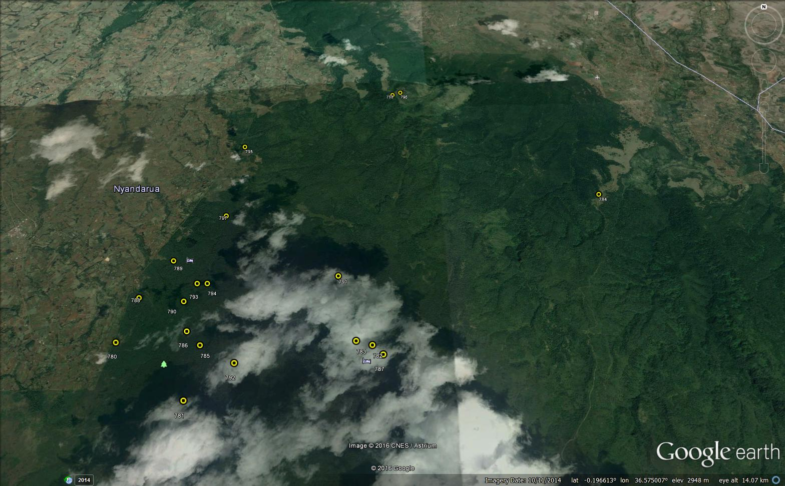

<!-- README.md is generated from README.Rmd. Please edit that file -->


# vegtable

The aim of `vegtable` is to provide a way for handling databases stored in
[Turboveg](http://www.synbiosys.alterra.nl/turboveg).
This package incorporates many concepts and some functions included in the
package [vegdata](https://cran.r-project.org/package=vegdata)
but the main difference is that `vegtable` implements an `S4` class
(`'vegtable'`) containing all elements of a database in just one object.
`vegtable` also implement some methods for this kind of objects.

You may also be aware, that species lists in `vegtable` are handled by the
package [taxlist](https://github.com/kamapu/taxlist), thus it will be
recommendable to start looking at the `taxlist-manual`.

This package has been developed as a tool handling data stored in
[SWEA-Dataveg](http://www.givd.info/ID/AF-00-006).
Further development is running in the context of the project
[GlobE-wetlands](https://www.wetlands-africa.de/).

An important source of inspiration for `vegtable` have been the enthusiastic
discussions during several versions of the
[Meetings on Vegetation Databases](http://www.hswt.de/person/joerg-ewald/vegetationsdatenbanken.html).

## Updating to the last version of vegtable
The very first step is to install the package
[devtools](https://github.com/hadley/devtools) and dependencies.
Then you just need to execute following commands in your R-session:


```r
library(devtools)
install_github("kamapu/vegtable")
```

## Some examples
The current version of `vegtable` includes an example data, which corresponds
to a subset from [SWEA-Dataveg](http://www.givd.info/ID/AF-00-006).
This data set contains plot observations done in Kenya imported from 5 sources.


```r
library(vegtable)
data(sweadataveg)

# validate and explore
validObject(sweadataveg)
#> [1] TRUE
summary(sweadataveg)
#> db.name: Sweadataveg
#> sp.list: Easplist
#> dictionary: Swea
#> 
#> 1946 observations (plots).
#> 60 variables with records.
#> 
#> Summary of species list:
#> 2230 names for 1573 taxa 
#> 0 (0%) taxa with first name entries
#> 2 variables for taxon traits 
#> 1 taxon view(s) 
#> validation for class 'taxlist': TRUE 
#> 
#> validation for class 'vegtable': TRUE
```

Among others, the object contains plot observations done in the Aberdare
National Park (Kenya) by __Schmitt (1991)__.
We can make a subset including the plots classified by the mentioned author into
the *Juniperus procera*-*Podocarpus latifolius* community (IDs 780 to 798).


```r
Juniperus <- sweadataveg[paste(780:798),]
summary(Juniperus)
#> db.name: Sweadataveg
#> sp.list: Easplist
#> dictionary: Swea
#> 
#> 19 observations (plots).
#> 60 variables with records.
#> 
#> Summary of species list:
#> 200 names for 149 taxa 
#> 0 (0%) taxa with first name entries
#> 2 variables for taxon traits 
#> 1 taxon view(s) 
#> validation for class 'taxlist': TRUE 
#> 
#> validation for class 'vegtable': TRUE
```

Note that the access is done as in a `data.frame` object.
Herewith the indexes in the square brackets will be referred to the slot `header`
in the `vegtable` object.

For geo-referenced plots, there is an option for a quick display on
[Google Earth](https://www.google.com/earth).
You may then apply following command:


```r
obj2kml(Juniperus, "Juniperus.kml")
```

Then you may get a map like this:


